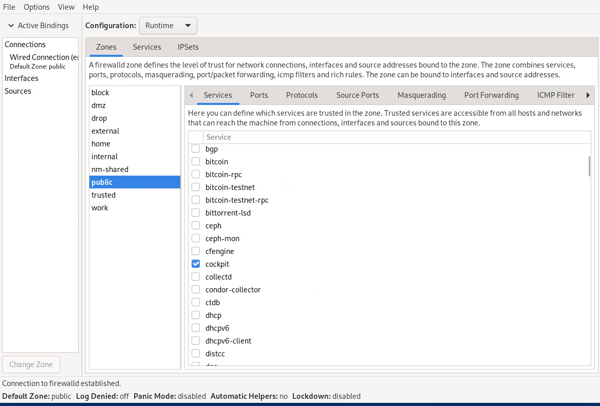

<!--
SPDX-FileCopyrightText: 2023,2024 Oracle and/or its affiliates.
SPDX-License-Identifier: CC-BY-SA-4.0
-->
# Configuring a Packet Filtering Firewall

This chapter describes the concepts, tools, and methods for configuring the firewall by using packet filtering. It also provides examples for displaying the firewall settings that enforce network security on a system.

## About Packet-Filtering Firewalls

A firewall filters incoming and outgoing network packets, based on packet header information. You create packet filter rules that detect whether packets are accepted or rejected. If you create a rule to block a port, any request to that port is rejected by the firewall and the request is ignored. Any service that's listening on a blocked port is effectively disabled.

The Enterprise Linux kernel uses the Netfilter feature to provide packet filtering functionality for IPv4 and IPv6 packets.

Netfilter consists of two components:

-   A `netfilter` kernel component consisting of a set of tables in memory for the rules that the kernel uses to control network packet filtering.

-   Utilities to create, maintain, and display the rules that `netfilter` stores. In Enterprise Linux 9, the default firewall utility is the `firewall-cmd`, which is provided by the `firewalld` package.


The `firewalld`-based firewall has the following advantages:

-   The `firewalld-cmd` utility doesn't restart the firewall and disrupt established TCP connections.

-   `firewalld` supports dynamic zones, which enable you to implement different sets of firewall rules for systems such as laptops that can connect to networks with different levels of trust. However, this feature isn't typically used on server systems.

-   `firewalld` supports D-Bus for better integration with services that depend on firewall configuration.


## Firewall Configuration Tools

You can configure the firewall by using one of the following tools:

-   By using the `firewall-cmd` command and its several options.

-   By using the Firewall Configuration GUI

    To use this tool you must install the `firewall-config` package first, then start it by using the same command as the package name, for example:

    ```
    sudo dnf install firewall-config
    ```

    ```
    sudo firewall-config &
    ```

    The command opens the configuration tool, as shown in the following figure:

    

-   Cockpit is a browser-based configuration tool that you can also use to perform firewall configurations.


## Controlling the Firewall Service

In Enterprise Linux 9, the firewall service, `firewalld`, is enabled by default. The service is controlled by the `systemctl` command.

To start the service:

```
sudo systemctl unmask firewalld
```

```
sudo systemctl start firewalld
```

To ensure that the service starts automatically when the system starts, run the following command after starting the firewall:

```
sudo systemctl enable firewalld
```

To stop the firewall service and prevent it from automatically starting when the system starts, run the following command:

```
sudo systemctl stop firewalld
```

```
sudo systemctl disable firewalld
```

To prevent the firewall service from being started by other services or through the `firewalld` D-Bus interface, run the following command after disabling the firewall:

```
sudo systemctl mask firewalld
```

To display the current status of the firewall service:

```
sudo systemctl status firewalld
```

```
firewalld.service - firewalld - dynamic firewall daemon
     Loaded: loaded (/usr/lib/systemd/system/firewalld.service; enabled; vendor preset: enabled)
     Active: active (running) since Thu 2022-05-05 08:41:36 GMT; 5 days ago
       Docs: man:firewalld(1)
   Main PID: 1155 (firewalld)
      Tasks: 4 (limit: 93659)
     Memory: 32.5M
        CPU: 1.438s
     CGroup: /system.slice/firewalld.service
             └─1155 /usr/bin/python3 -s /usr/sbin/firewalld --nofork --nopid
```

## About Zones and Services

Firewall security is implemented through the concepts of zones and services.

Zones are predefined sets of filtering rules that correspond to levels of trust for network access. You can add to the default filtering rules of a zone by reconfiguring the zone's settings and therefore refine the zone's control of traffic flow. When you install Enterprise Linux, a default zone called `public` is automatically assigned to the system.

Firewall rules are applied through services that are assigned to a zone. The service ports are the access points of network traffic. Services assigned to a zone automatically have their ports opened to receive and send network packets.

For more information about zones and firewall-related services, see the `firewalld.zone(5)` and the `firewalld.service(5)` manual pages.

### Displaying Information About Zones

When you configure the firewall for zones, displaying the current zone and service settings and other information as part of the configuration steps is a good practice. With this approach you can monitor the changes you're introducing to the firewall and identify potential errors that would make the changes invalid.

To display the system's default zone, run the following command:

```
sudo firewall-cmd --get-default
```

List all the predefined zones that are included in the installation as follows:

```
sudo firewall-cmd --get-zones
```

```
block dmz drop external home internal nm-shared public trusted work
```

You can configure any zone in the list. As you change settings of a particular zone, that zone becomes an active zone. To identify the active zone, type the following:

```
sudo firewall-cmd --get-active-zone
```

**Note:**

By default, all configurations are implemented on the default zone. Note also that an active zone isn't necessarily the default zone. Therefore, you must specify the zone name in the command to define settings for that specific zone. Otherwise, the definitions are applied to the default zone.

### Displaying Zone Settings

To obtain the settings of a zone:

```
sudo firewall-cmd --list-all [--zone=*zonename*]
```

Without specifying a zone, the command displays the settings of the default zone. Thus, to list the settings of the `work` zone, you would use the following command;

```
sudo firewall-cmd --list-all --zone=work
```

```nocopybutton
work
  target: default
  icmp-block-inversion: no
  interfaces: 
  sources: 
  services: cockpit dhcpv6-client ssh
  ports: 
  protocols: 
  forward: yes
  masquerade: no
  forward-ports: 
  source-ports: 
  icmp-blocks: 
  rich rules: 
```

## Configuring firewalld Zones

The following tasks describe how to use the `firewall-cmd` command to configure firewall rules for a zone. The rules are then recorded in the `/etc/firewalld` hierarchy for `firewalld`.

Configuring the firewall means setting all or some of a zone settings to specific values to enable the firewall to control network traffic according to specifications.

### Controlling Access to Services

Setting the `services` of a zone is the default way to configure the firewall. Each zone has predefined services assigned to it. To configure this setting further, you either add services to the zone or remove services from the zone.

To list predefined services, use the `firewall-cmd --list-services` command.

For example, the following command shows that the `work` zone has the `cockpit`, `dhcpv6-client`, and `ssh` services assigned to it:

```
sudo firewall-cmd --list-services --zone=work
```

```nocopybutton
cockpit dhcpv6-client ssh
```

To open access to a new service, use the `--add-service` *service* option. Optionally, include the `--permanent` option to make the rule persistent across reboots.

For example, to add the HTTP and NFS services to the `work` zone, you would use the following command:

```
sudo firewall-cmd --permanent --zone=work --add-service=http --add-service=nfs
sudo firewall-cmd --list-services --zone=work
```

```nocopybutton
cockpit dhcpv6-client ssh http nfs
```

To remove access to a service, use the `--remove-service` *service* option:

```
sudo firewall-cmd --permanent --zone=work --remove-service=cockpit
sudo firewall-cmd --list-services --zone=work 
```

```nocopybutton
dhcpv6-client ssh http nfs
```

### Controlling Access to Ports

Network traffic through the zone's services uses the ports of those services. Ports must be opened to accept traffic. You can open more ports for network access by specifying the port number and the associated protocol.

The `--list-ports` option lists the ports and associated protocols to which you have explicitly allowed access. However, ports that have been opened as a service aren't included in this command's output. Therefore, when listing ports, the best practice is to use the `--list-all` option to obtain more complete information.

Use the `--add-port` option to allow access to specific ports. Ports must be specified by using the format *port-number*/*port-type*. Port types can be `tcp`, `udp`, `sctp`, or `dccp`. Ensure that the type and the network traffic match, for example:

```
sudo firewall-cmd --permanent --zone=work --add-port=5353/udp --add-port=3689/tcp
sudo firewall-cmd --list-all --zone=work 
```

```nocopybutton
work
  target: default
  icmp-clock-inversion: no
  interfaces:
  sources:
  services: dhcpv6-client ssh http nfs 
  ports: 5353/udp 3689/tcp
...
```

Similarly, the `--remove-port` option removes access to a port. Remember to use the `--permanent` option to make the change persist.

For more information, see the `firewall-cmd(1)` manual page.

### Assigning a Network Interface to a Zone

A system's network interface is automatically assigned to the default zone. In Enterprise Linux, you can configure multiple zones with their specific services, ports, and so on. You then activate a specific zone's rules to become operative by assigning the interface to that zone. Thus, you have the flexibility to easily change the firewall rules that are active on the system by reassigning the network interface.

Suppose that you want to activate the firewall configuration of the `work` zone. You would assign the interface to the zone as follows:

```
sudo firewall-cmd --zone=work --change-interface=enp0s1
sudo firewall-cmd --get-active-zone
```

```nocopybutton
work
  interfaces: enp0s1
```

**Note:**

You don't need to use the `--permanent` option to make the setting persist across reboots. If you set the zone to be the default zone, as explained in [Changing the Default Zone](firewall-ConfiguringaPacketFilteringFirewall.md#), then the interface reassignment becomes permanent.

### Changing the Default Zone

You can change a system's default zone as follows:

```
sudo firewall-cmd --set-default-zone=work
```

You can also verify that the changes have been applied:

```
sudo firewall-cmd --get-default-zone
```

To display the entire and final results of the configuration:

```
sudo firewall-cmd --zone=work --list-all
```

```nocopybutton
work (active)
  target: default
  interfaces:  enp0s1
  sources:
  services: dhcpv6-client ssh http nfs
  ports: 5353/udp 3689/tcp
...
```

### Setting a Default Rule for Controlling Incoming Traffic

The `target` setting establishes the default behavior of the firewall when managing incoming traffic. This zone setting is automatically configured to `default` for all the predefined zones. To change the default behavior of a zone, use the following command;

```
sudo firewall-cmd --zone=*zone-name* --set-target=ACCEPT|REJECT|DROP
```

You can specify the following options:

-   `ACCEPT` accpets all incoming traffic except those you have set to be rejected in another rule.

-   `REJECT` blocks all incoming traffic except those you have allowed in another rule. The source machine is informed about the rejecion.

-   `DROP` is similar to `REJECT` but no notice of the rejection is sent to the source machine.


### Managing Incoming Traffic Based on Sources

You can manage incoming traffic to a zone based on the traffic source. The two following two zone settings enable you to specify the origin of the packets:

-   `source` identifies the sending node or network.

-   `source-ports` identifies the port from which traffic originates.


To accept incoming traffic from a sending node, use the following command:

```
sudo firewall-cmd --zone=*zone-name* --add-source=*IP-address*                  
```

Note that the IP address can include the netmask in CIDR notation, such as `192.0.2.0/24`.

Run the following command to transform the current runtime ruleset to a permanent ruleset:

```
sudo firewall-cmd --runtime-to-permanent
```

Omit this command if you're setting a temporary configuration that's dropped if the system is rebooted.

The following similar syntax is used to set the `source-port` setting. However, you identify the source port by specifying the sending port number and the protocol type, for example:

```
sudo firewall-cmd --zone=*zone-name* --add-source-ports=*port-number*/tcp|udp|sctp|dccp
```

You can combine different settings to configure the firewall. The `trusted` zone can be configured to accept HTTP traffic from the `192.0.2.0` network source, as shown in the following example:

```
sudo firewall-cmd --zone=trusted --add-source=192.0.2.0/24
sudo firewall-cmd --zone=trusted --add-service=http
sudo firewall-cmd --zone=trusted --list-all
```

```nocopybutton
trusted (active)
  target: ACCEPT
  sources: 192.0.2.0/24
  services: http
```

## Creating Customized Zones for Firewall Implementation

You can create zones and then configure the zone's settings for a customized firewall protection.

### Using the firewall-cmd Command

As shown in the following example, you can use the `firewall-cmd` CLI to create an empty zone, which means that no default services are assigned. When configuring a customized zone, you must always include the `--permanent` option in the command. Otherwise, an error message is generated.

```
sudo firewall-cmd --permanent --new-zone=testzone
sudo firewall-cmd --permanent --get-zones
```

```nocopybutton
block dmz drop external home internal nm-shared public testzone trusted work
```

```
sudo firewall-cmd --permanent --info-zone=testzone
```

```nocopybutton
testzone
  target: default
  icmp-block-inversion: no
  interfaces:
  sources:
  services:
  ports:
  protocols:
  masquerade: no
  forward-ports:
  source-ports:
  icmp-blocks:
  rich rules:

```

Without the `--permanent` option, the `--get-zones` option does not display the created zone.

The `--info-zone=*zone-name*` option generates the same output as the `--list-all` option.

To make this zone creation persistent, add the following command:

```
sudo firewall-cmd --runtime-to-permanent
```

After creating the zone, you can add services, ports, assign interfaces, and so on, by using the command options that are provided in the previous examples:

```
sudo firewall-cmd --zone=testzone --add-service=http
```

```nocopybutton
Error: INVALID ZONE: testzone
```

```
sudo firewall-cmd --permanent --zone=testzone --add-service=http
```

Ensure that you use the `--permanent` option when using these commands.

### Using a Zone Configuration File

All zones have corresponding configuration files. For the predefined zones that are installed with the operating system, the configuration files are in the `/usr/lib/firewalld/zones` directory.

When you configure a predefined zone, the configuration file is copied to the `/etc/firewalld/zones` directory and the changes are stored in that location. If you use a configuration file to create new zones, you must also use `/etc/firewalld/zones` as the working directory.

If you're creating a zone with only minor differences from the settings of predefined zones, copying an existing configuration file to the working directory is the easiest approach. You can use either of the following commands:

```
sudo cp /etc/firewalld/zones/*existing-conf-file*.xml *new-zone*.xml
```

```
sudo cp /usr/lib/firewalld/zones/*existing-conf-file*.xml /etc/firewalld/zones/*new-zone*.xml
```

Then, using a text editor, revise the settings in the new configuration file. The following example shows what the configuration file of `testzone` might contain. `testzone` accepts traffic for one service \(SSH\) and one port range for the TCP and UDP protocols:

```
<?xml version="1.0" encoding="utf-8"?>
<zone>
  <short>testzone</short>
  <description>*Put description here*</description>
    <service name="ssh"/>
    <port port="1025-65535" protocol="tcp"/>
    <port port="1025-65535" protocol="udp"/>
</zone>
   
```

