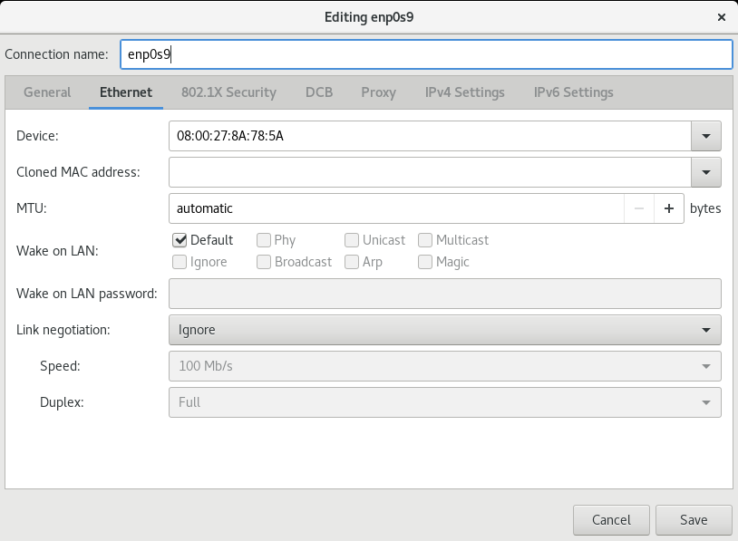

<!--
SPDX-FileCopyrightText: 2023,2024 Oracle and/or its affiliates.
SPDX-License-Identifier: CC-BY-SA-4.0
-->

# Configuring the System's Network

To enable the system to connect to the network, transmit and receive traffic with other systems, you would need to configure the system to have identifiable names, IP addresses, routes, and so on. Depending on the system's available resources, you can further optimize the network configuration to attain high availability and improved performance by implementing added network technologies such as network bonds and multipathing.

## Network Configuration Tools

Different tools are available to configure the network. All them typically perform the same functions. You can select any tool or a combination of tools to manage the network.

- Cockpit is a web-based configuration tool for managing network configuration, including network interfaces, bonds, bridges, virtual VLANs, and the firewall.

- GNOME based tools

  If you selected the default System With GUI installation profile or environment to install Enterprise Linux, these tools are automatically included.

  - The GNOME settings application enables you to perform various system configurations, including networking. To access this application, click the network icon at the upper right of the desktop and select **Settings**. Alternatively, click Activities on the desktop's menu bar, select Show Applications, then select Settings. From the list on the left panel, select the type of configuration you want to do.
  - The Network Connection Editor is a subset of the GNOME settings application which you can use to directly perform network configurations. To start the editor, type the `nm-connection-editor` command on a terminal window.

- `NetworkManager` command line tools

  Use these tools if you didn't select the Server With GUI installation profile to install Enterprise Linux.

  - To start `NetworkManager`'s text based user interface \(TUI\), type the `nmtui` command on a terminal window. Navigate through the interface by using keyboard keys instead of the mouse device.
  - `NetworkManager`'s command line consists of the `nmcli` command with different subcommands and options. With a combination of subcommands, options, and arguments, you can complete network configurations in a single command syntax. Other commands, such as `ip` and `ethtool`, complement `nmcli` for configuring and managing network settings. Optionally, to avoid entering long commands, you can use `nmcli` in interactive mode.

    For more information, see the `nmcli(1)`, `ip(8)`, and `ethtool(8)` manual pages.

## Configuring Network Interfaces

The following information describes how to configure a NIC by using the tools that were described in previous sections.

### About Network Interface Names

Traditionally, early kernel versions assigned names to network interface devices by assigning a prefix, which is typically based on the device driver, and a number, such as `eth0`. With the availability of different types of devices, this naming schema is no longer efficient. The names don't necessarily correspond to the chassis labels and the names themselves might be inconsistent across existing network interfaces. The inconsistency would affect embedded adapters on the system, including add-in adapters. Server platforms with several network adapters could have problems managing these interfaces.

Enterprise Linux implements a consistent naming scheme for all network interfaces through the `udev` device manager. The scheme offers the following advantages:

- The names of the devices are predictable.

- Device names persist across system reboots or after changes are made to the hardware.

- Defective hardware can easily be identified and thus replaced.

The feature that implements consistent naming on devices is enabled in Enterprise Linux by default. Network interface names are based on information that's derived from the system BIOS. Alternatively, they can be based on a device's firmware, system path, or MAC address.

Network interfaces are identified by a name that combines a prefix and a suffix. The prefix depends on the type of network interface:

- Ethernet network interfaces: `en`

- Wireless local area network \(LAN\) interfaces: `wl`

- Wireless wide area network \(WAN\) interfaces: `ww`

The suffix contains any of the following information:

- An on-board index number `o*n*`, and thus, `eno0` .

- A hot-plug slot index number `s*n*`, and thus, `ens1`.

  This naming schema can also include `f*function*` and `d*device-id*` that are added to the suffix.

- The bus and slot number `p*bus*s*n*`, and thus. `enp0s8`.

  This naming schema can also include `f*function*` and `d*device-id*` that are added to the suffix.

- The MAC address `x*MAC-addr*`, and thus, `enx0217b08b`.

  Note that this naming format isn't used by Enterprise Linux by default. However, administrators can implement it as an option.

### Using the Network Connection Editor GUI

1. If not already installed, install the `nm-connection-editor` package.

   ```
   sudo dnf install -y nm-connection-editor
   ```

2. Start the editor:

   ```
   sudo nm-connection-editor
   ```

   The editor detects the network devices that are on the system and lists them and their current states:

   

3. To add or remove a connection, use the plus \(+\) or minus \(-\) buttons at the bottom of the editor window.

   If you add a connection, a window that prompts you for the connection type opens. Select a type, such as Ethernet, from the drop down list, then click **Create**. The Interface Editor window opens.

   **Note:**

   The same window opens if you edit an existing connection.

   

4. Click each tab as needed and enter the required information about the interface.

5. Click **Save** after you have completed the configuration.

   You must specify all the required information. Otherwise, the settings can't be saved and the editor's background terminal window would display messages that indicate the errors.

### Using the Text Based User Interface

1. If not already installed, install the `NetworkManager-tui` package.

   ```
   sudo dnf install -y NetworkManager-tui
   ```

2. Open `NetworkManager`'s text-based user interface.

   ```
   sudo nmtui
   ```

   

   To navigate the tool, use the up and down arrow keys, then press **Enter** to make a selection

3. To add a connection, select **Edit a connection**, then click **Add**.

4. After selecting a connection type, the Edit Connection window opens.

   

5. As an option, specify a preferred profile name and the name of the device.

6. By default, IPv4 and IPv6 configurations are set to Automatic. To change the setting, select the Automatic field and press Enter. From the drop down list, select the type of IP configuration that you want to implement, such as Manual. Then, select the corresponding **Show** field.

   The fields that are displayed depend on the type of IP configuration that's selected. For example, to manually configure an IP address, selecting **Show** displays an address field, where you would enter an IP addresses for the interface, as the following figure illustrates.

   

7. Navigate through all the fields on the screen to ensure that the required information is specified.

8. After you have edited the connection, select **OK**.

### Using the Command Line

To illustrate the different uses of the `nmcli` command, this procedure describes an example of adding and configuring a new Ethernet connection for the `enp0s2` device. For more information about the command, see the `nmcli(1)` manual page.

**Tip:**

Before adding the connection, prepare the information you would need for the configuration, such as the following:

- Connection name, for example, `My Work Connection`. The `nmcli` command works by referring to the connection name rather than the device name. If you don't set a connection name, then the device's name is used as the connection name.

- IP addresses \(IPv4 and, if needed, IPv6\)

- Gateway addresses

- Other relevant data you want to set for the connection

1. \(Optional\): Display the network devices on the system.

   ```
   sudo nmcli device status
   ```

   ```nocopybutton
   DEVICE  TYPE      STATE          CONNECTION
   enp0s1  ethernet  connected      enp0s1   
   enp0s2  ethernet  disconnected    --   
   lo      loopback  unmanaged

   ```

   The command shows whether a device is connected or disconnected, and whether it is managed or unmanaged.

2. \(Optional\) Display the connection information about the network devices.

   ```
   sudo nmcli con show [--active]
   ```

   ```nocopybutton
   NAME     UUID                                TYPE      DEVICE
   enp0s1   *nn-nn-nn-nn-nn*  ethernet  enp0s1
   virbr0   *nn-nn-nn-nn-nn*  bridge    virbr0
   mybond   *nn-nn-nn-nn-nn*  bond      bond0
   ```

   The `con` subcommand is the short form of `connection`, and can be further shortened to `c`. Specifying the `--active` option would display only active devices.

   Note that in the output, `NAME` represents the connection ID.

3. Add a new connection.

   ```
   sudo nmcli con add {*properties*} [*IP-info*] [*gateway-info*
   ```

   - **_properties_**

     The connection name as specified by the `con-name` argument, the type of connection as specified by the `type` argument, and the interface name as specified by the `ifname` argument.

   - **_IP-info_**

     The IPv4 or IPv6 address as specified by either the `ip4` or `ip6` argument. The address must be in the format `address/netmask`. The IPv4 address can be in CIDR form, for example, `1.2.3.4/24`.

   - **_gateway-info_**

     The gateway IPv4 or IPv6 address as specified by either the `gw4` or `gw6` argument.

   For example, to add the connection with the information at the beginning of this procedure, you would type:

   ```
   sudo nmcli con add type ethernet ifname enp0s2 con-name "My Work Connection" ip4 192.168.5.10/24 gw4 192.168.5.2
   ```

   The output would acknowledge that the connection is successfully completed.

4. Activate the interface.

   ```
   sudo nmcli con up "My Work Connection"
   ```

5. \(Optional\) Display the configuration properties of the new connection.

   ```
   sudo nmcli [-o] con show "My Work Connection
   ```

   ```nocopybutton
   connection.id:               My Work Connection
   connection.uuid:             *nn-nn-nn-nn-nn*
   connection.type:             802-3-ethernet
   connection.interface-name:   enp0s2
   ...
   IP4.ADDRESS[1]:              192.168.5.10
   IP4.GATEWAY:                 192.168.5.2
   ...
   ```

   Specifying the `-o` option displays only properties that have configured values.

After you have created the connection, a corresponding profile is created. For more information on connection profiles, see [Using NetworkManager Connection Profiles](network-ConfiguringtheSystemsNetwork.md#).

```
ls -lrt /etc/sysconfig/network-scripts/ifcfg*
```

```nocopybutton
...
-rw-r--r--. 1 root root 266 Aug  6 11:03 /etc/sysconfig/network-scripts/ifcfg-My_Work_Connection
```

## Configuring Network Routing

A system uses its routing table to identify which network interface to use when sending packets to remote systems. For a system with only a single interface, configuring the IP address of a gateway system on the local network suffices to route packets to other networks. For example, see the image [Figure 5](network-ConfiguringtheSystemsNetwork.md#tui-addaddress), which shows a field where you can enter the IP address of the default gateway.

On systems that have several IP interfaces, you can define static routes so that traffic for a special host or network is forwarded to that network through the default gateway. You use the same tools to configure routing as you do to configure network interfaces.

### Using the Network Connection Editor

To create a static route to the 192.0.2.0/24 network through the gateway 198.51.100.1, ensure first that the default gateway 198.51.100.1 is reachable on the interface. Then, complete the following steps:.

1. Start the editor.

   ```
   nm-connection-editor
   ```

2. From the list of connections, select the device under the connection name for which you want to create a static route. For example, under `myconnection`, you would select the device `ens3`.

3. Click the settings icon \(gear wheel\) to edit the connection settings.

4. Click the IPv4 Settings tab.

5. Click **Routes**.

6. Click **Add**.

7. Enter the network's address and netmask for which the route is created, and specify the gateway IP address through which the route is established. You can optionally enter a metric value and select the other available options on display.

   

8. Clcik **OK** and then save.

9. Back at the terminal window, restart the connection.

   This step causes the connection to temporarily drop.

   ```
   sudo nmcli connection up myconnection
   ```

10. Optionally, verify that the new route is active.

    ```
    ip route
    ```

    ```nocopybutton
    ...
    192.0.2.0/24 via 198.51.100.1 dev myconnection proto static metric 100
    ```

### Using the Command Line

To configure static routes with the `nmcli` command, use the following syntax:

```
nmcli connection modify *connection\_name* +ipv4.routes "*ip*[/*prefix*] *options\(s\)* *attribute\(s\)*"[next_hop] [metric] [attribute=value] [attribute=value] ..."
```

- **+ipv4.routes**

  The plus \(+\) sign indicates that you're creating an IPv4 route. Without the sign, the command changes an existing IPv4 setting.

- **_connection-name_**

  Connection name or label for which you're creating a static route.

- **_ip_\[/_prefix_\]**

  IP address of the static route that you're creating. The IP address can also be in CIDR notation.

- **_options_**

  Options include next hop addresses and optional route metrics. These options are separated by spaces. For more information, see the `nm-settings-nmcli(5)` manual pages.

- **_attributes_**

  Attributes are entered as _attribute=value_ and are also separated by spaces. Some attributes are `mtu`, `src`, `type`, `cwnd`, and so on. For more information, see the `nm-settings-nmcli(5)` manual pages.

Suppose that you have the following configurations:

- Name of the connection: `myconnection`
- Default gateway address: 198.51.100.1
- Network to which you want to create a statci route: 192.0.2.0/24

To create the route, ensure first that the default gateway for the route is directly reachable on the interface. Then, do the following:

1. Create the static route.

   ```
   sudo nmcli connection modify myconnection +ipv4.routes "192.0.2.0/24 198.51.100.1"
   ```

   To create several static routes in a single command, separate the _route gateway_ entries with commas, for example:

   ```
   sudo nmcli connection modify myconnection +ipv4.routes "192.0.2.0/24 198.51.100.1, 203.0.113.0/24 198.51.100.1"
   ```

2. Verify the new routing configuration.

   ```
   nmcli connection show myconnection
   ```

   ```nocopybutton
   –-
   ipv4.routes:   { ip = 192.0.2.0/24, nh = 198.51.100.1 }
   –-
   ```

3. Restart the network connection.

   This step causes the connection to temporarily drop.

   ```
   sudo nmcli connection up myconnection
   ```

4. Optionally, verify that the new route is active.

   ```
   ip route
   ```

   ```nocopybutton
   ...
   192.0.2.0/24 via 198.51.100.1 dev example proto static metric 100
   ```

### Using the Command Line in Interactive Mode

You can also use the `nmcli` command in interactive mode to configure network settings, including configuring static routes. When in interactive mode, the `nmcli>` prompt appears where you can run commands to configure static routes for a specific connection profile.

The procedure in this section assumes the following network settings for creating the static route:

- Name of the connection: `myconnection`
- Default gateway address: 198.51.100.1
- Network to which you want to create a statci route: 192.0.2.0/24

To create the route, ensure first that the default gateway for the route is directly reachable on the interface. Then, do the following:

1. Start the command's interactive mode.

   ```
   sudo nmcli connection modify myconnection
   ```

   ```nocopybutton
   nmcli>
   ```

2. Create the static route.

   ```
   nmcli> set ipv4.routes 192.0.2.0/24 198.51.100.1
   ```

3. Optionally, display the new configuration.

   ```
   nmcli> print
   ```

   ```nocopybutton
   ...
   ipv4.routes:        { ip = 192.0.2.1/24, nh = 198.51.100.1 }
   ...
   ```

4. Save the configuration.

   ```
   nmcli> save persistent
   ```

5. Restart the network connection.

   This step causes the connection to temporarily drop.

   ```
   nmcli> activate myconnection
   ```

6. Exit the interactive mode.

   ```
   nmcli> quit
   ```

7. Optionally, verify that the new route is active.

   ```
   ip route
   ```

   ```nocopybutton
   ...
   192.0.2.0/24 via 198.51.100.1 dev example proto static metric 100
   ```

## Using NetworkManager Connection Profiles

Each network connection configuration that you create becomes a `NetworkManager` connection profile on the system. In Enterprise Linux 9, profiles can only be in the key file format. Because network scripts have been removed in Enterprise Linux 9, the `ifcfg` format capability that manages these scripts has also been removed.

Depending on its purpose, a `NetworkManager` connection profile can be stored in one of the following locations:

- `/etc/NetworkManager/system-connections/`: Default location of persistent profiles that are created by the user. Profiles in this directory can also be edited.
- `/run/NetworkManager/system-connections/`: Location of temporary profiles that are automatically removed when you reboot the system.
- `/usr/lib/NetworkManager/system-connections/`: Location of predeployed and permanent connection profiles. If you edit one of these profiles by using the `NetworkManager` API, then the profile is copied either to the persistent or the temporary directory.

For more information about configuring `NetworkManager` connection profiles, see:

- [Creating a keyfile Connection Profile in Offline Mode Using nmcli](network-ConfiguringtheSystemsNetwork.md#)
- [Creating a keyfile Connection Profile Manually](network-ConfiguringtheSystemsNetwork.md#)
- [Renaming Process Differences Between Connection Profile Formats](network-ConfiguringtheSystemsNetwork.md#)
- [Converting Connection Profile Formats From ifcfg to keyfile](network-ConfiguringtheSystemsNetwork.md#)

### Creating a `keyfile` Connection Profile in Offline Mode Using `nmcli`

When creating or updating `NetworkManager` profile connections, we recommend using its CLI tool in offline mode \(`nmcli --offline`\). In offline mode, `nmcli` operates without the `NetworkManager` service, which offers user enhanced editing control and the ability to create various connection profiles in `keyfile` format. For example, you can create the following type of connection profiles in `keyfile` format:

- static Ethernet connection
- dynamic Ethernet connection
- network bond
- network bridge
- VLAN or any kind of enabled connections

To create a `keyfile` connection profile using `nmcli` in offline mode, follow these steps:

1. Use the required `NetworkManager` configuration properties to create a profile connection in offline mode.

   For example, the following syntax creates a keyfile connection profile in offline mode for an Ethernet device with a manually assigned IPv4 address and DNS address.

   ```
   nmcli --offline connection add type ethernet con-name *Example-Connection* ipv4ddresses *\#\#\#.\#.\#.\#/\#* ipv4ns *\#\#\#.\#.\#.\#\#\#* ipv4ethod manual > /etc/NetworkManager/system-connections/*outputmconnection*
   ```

   _where_:

   - `nmcli --offline` = ncmi mode property, which instructs `nmcli` to operate in offline mode.
   - `connection add type ethernet` = add connection and type properties, which is used to create a connecton profile and specify a connection type value \(in this example: Ethernet\).
   - `con-name` = connection name property, which is saved into the `id` variable for the generated connection profile.

     When you manage this connection later, using `nmcli`, note the following `id` variable usages:

     - In cases where the `id` variable is provided, use the connection name. For example: `Example-Connection`.
     - In cases where the `id` variable is omitted, use the file name without the `.nmconnection` suffix, for example `output.`
       **Note:** For more information about connection profile properties and their settings, see the `nm-settings(5)` manual page.

2. Set permissions to the configuration file so that only the `root` user can read and update it. For example:

   ```
   chmod 600 /etc/NetworkManager/system-connections/*outputmconnection*
   chown root:root /etc/NetworkManager/system-connections/*outputmconnection*
   ```

3. Start the `NetworkManager` service:

   ```
   systemctl start NetworkManager.service
   ```

4. If you set the `autoconnect` variable in the profile to `false`, activate the connection:

   ```
   nmcli connection up *Example-Connection*
   ```

5. \(Optional\) To verify the profile configuration, perform these steps:
   1. Verify that the `NetworkManager` service is running, for example:

      ```
      systemctl status NetworkManager
      ● NetworkManager.service - Network Manager
         Loaded: loaded (/usr/lib/systemd/system/NetworkManager.service enabled vendor preset: enabled)
         Active: active (running) because Wed -03 13:08:32 CEST   ago

      ```

   2. Verify that `NetworkManager` can read the profile from the configuration file, for example:

      ```
      nmcli -f TYPE,FILENAME,NAME connection
      TYPE      FILENAME                                                    NAME
      ethernet /etc/NetworkManager/system-connections/outputmconnection Example-Connection
      ethernet  /etc/sysconfig/network-scripts/ifcfg-enp0                 enp0

      ```

      If the output doesn't display the newly created connection, verify that the `keyfile` permissions and the syntax used are correct.

   3. To display the connection profile use the `nmcli connection show` command, for example:

      ```
      nmcli connection show *Example-Connection*
      connection.id:                          Example-Connection
      connection.uuid:                        ce8d4422-9603-4d6f-b602-4f71992c49c2
      connection.stable-id:                   --
      connection.type:                        802-3-ethernet
      connection.interface-name:              --
      connection.autoconnect:                 yes
      ```

### Creating a `keyfile` Connection Profile Manually

To manually create a `NetworkManager` connection profile in a keyfile format, follow these steps:

**Note:** Manually creating or updating the configuration files can result in an unexpected network configuration. Another option would be to use `nmcli` in offline mode. See

1. If you're creating a profile for a hardware interface, such as Ethernet, display the hardware's MAC address.

   ```
   ip address show ens3
   ```

   ```
   2: ens3: <BROADCAST,MULTICAST,UP,LOWER_UP> mtu 9000 qdisc pfifo_fast state UP group default qlen 1000
       link/ether 02:00:17:03:b9:ae brd ff:ff:ff:ff:ff:ff
       ...
   ```

2. Use any text editor to create a connection profile that contains the network settings that you want to define for the connection.

   For example, if the connection uses DHCP, the profile would contain settings similar to the following example:

   ```
   [connection]
   id=myconnection
   type=ethernet
   autoconnect=true

   [ipv4]
   method=auto

   [ipv6]
   method=auto

   [ethernet]
   mac-address=02:00:17:03:b9:ae
   ```

3. Save the profile to `/etc/NetworkManager/system-connections/*filname*.nmconnection`.

   In this current procedure, the profile would be `/etc/NetworkManager/system-connections/myconnection.nmconnection`.

   **Note:** The defined ID variable, such as `myconnection`, doesn't need to be identical with the profile's file name, for example `myethernet.nmconnection`. When you change the profile by using the `nmcli` command, you can identify the profile by the defined ID \(`myconnection`\) or by the file name, but excluding the file extension name \(`myethernet`\).

4. Restrict the permissions of the profile.

   ```
   sudo chown root:root /etc/NetworkManager/system-connections/myconnection.nmconnection
   sudo chown 600 /etc/NetworkManager/system-connections/myconnection.nmconnection
   ```

5. Reload the connection profiles.

   ```
   sudo nmcli connection reload
   ```

6. Verify that `NetworkManager` can read the profile.

   ```
   sudo nmcli -f NAME,UUID,FILENAME connection
   ```

   ```
   NAME           UUID       FILENAME
   myconnection   *uuid*        /etc/NetworkManager/system-connections/myconnection.nmconnection
   ```

7. If you specified `false` for the profile's `autoconnect` parameter, then activate the connection.

   ```
   sudo nmcli connection up myconnection
   ```

### Renaming Process Differences Between Connection Profile Formats

In cases when you need to assign a custom name to an interface, the `udev` service renaming process works differently depending on the format of the connnection profile. For example,

- `ifcfg` format interface renaming process involves these steps:
  1. The `/usr/lib/udev/rules.d/60-net.rules``udev` rule calls the `/lib/udev/rename_device` helper utility.
  2. The helper utility searches for the `HWADDR` parameter in `/etc/sysconfig/network-scripts/ifcfg-*` files.
  3. If the value set in the variable matches the MAC address of an interface, the helper utility renames the interface to the name set in the `DEVICE` parameter of the file.
- `keyfile` format interface renaming process involves these steps:
  1. To rename an interface, create a [systemd link file](https://access.redhat.com/documentation/en-us/red_hat_enterprise_linux/8/html/configuring_and_managing_networking/consistent-network-interface-device-naming_configuring-and-managing-networking#configuring-user-defined-network-interface-names-by-using-systemd-link-files_consistent-network-interface-device-naming) or a [udev rule](https://access.redhat.com/documentation/en-us/red_hat_enterprise_linux/8/html/configuring_and_managing_networking/consistent-network-interface-device-naming_configuring-and-managing-networking#configuring-user-defined-network-interface-names-by-using-systemd-link-files_consistent-network-interface-device-naming).
  2. In the `NetworkManager` connection profile, specify the custom name in the `interface-name` property.

### Converting Connection Profile Formats From `ifcfg` to `keyfile`

To convert the `NetworkManager` legacy `ifcfg` profile formats to the preferred `NetworkManager` `keyfile` format, follow these steps:

**Note:** For more information about the `keyfile` profile format, see the [nm-settings-keyfile\(5\)](https://networkmanager.dev/docs/api/latest/nm-settings-keyfile.html) manual page.

1. Ensure that the following prerequisites are met:
   - Existing connection profiles in `ifcfg` format that are stored in the `/etc/sysconfig/network-scripts/` directory.
   - If the connection profiles contain a `DEVICE` variable that is set to a custom device name, such as `provider` or `lan`, you created a `systemd` link file or a `udev` rule for each of the custom device names.

2. Using the `nmcli`, migrate the `ifcfg` connection profiles to the preferred `keyfile` formats.

   ```
   nmcli connection migrate
   ```

3. \(Optional\) Verify that all the legacy `ifcfg` connection profiles migrated successfully:

   ```
   nmcli -f TYPE,FILENAME,NAME connection
   ```
